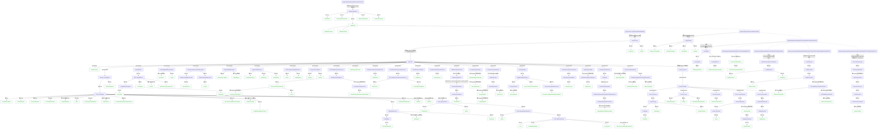

### 传说绿宝石函数地址查找流程

```mermaid
graph TB
    classDef needFunc fill:#F4FFF4,color:#008200;
    sDiplomaWinTemplates("sDiplomaWinTemplates(00050214100F0100FF)")
    sDiplomaWinTemplates --查找sDiplomaWinTemplates的指针--> InitDiplomaWindow
    InitDiplomaWindow --第1个bl--> InitWindows:::needFunc
    InitDiplomaWindow --第2个bl--> DeactivateAllTextPrinters:::needFunc
    InitDiplomaWindow --第3个bl---> LoadPalette:::needFunc
    InitDiplomaWindow --第4个bl--> FillWindowPixelBuffer:::needFunc
    InitDiplomaWindow --第5个bl--> PutWindowTilemap:::needFunc
    LoadPalette --> gPlttBufferUnfaded:::needFunc
    LoadPalette --> gPlttBufferFaded:::needFunc
    LoadPalette -.- sElevatorTripLength("sElevatorTripLength(08101820262E343839)")
    LoadPalette -.- sDiplomaBgTemplates("sDiplomaBgTemplates(F401000061120000)")
    sDiplomaBgTemplates --查找sDiplomaBgTemplates的指针--> InitDiplomaBg
    InitDiplomaBg --第2个bl--> InitBgsFromTemplates:::needFunc
    InitDiplomaBg --第3个bl--> SetBgTilemapBuffer:::needFunc
    InitDiplomaBg --第4个bl--> SetGpuReg:::needFunc
    InitDiplomaBg --第5个bl--> ShowBg:::needFunc
    sElevatorTripLength --查找sElevatorTripLength的指针--> MoveElevator
    MoveElevator --"查找MoveElevator的指针(special 0x114)"---> gSpecials
    MoveElevator --"第1个bl"--> CreateTask:::needFunc
    MoveElevator --"第4个bl"--> PlaySE:::needFunc
    gSpecials --"special 0x0"--> HealPlayerParty:::needFunc
    gSpecials --"special 0x10B"---> Special_ShowDiploma
    Special_ShowDiploma --第1个ldr---> CB2_ShowDiploma
    Special_ShowDiploma --第1个bl--> SetMainCallback2:::needFunc
    CB2_ShowDiploma --第1个bl--> SetVBlankCallback:::needFunc
    CB2_ShowDiploma --第17个bl--> ResetSpriteData:::needFunc
    CB2_ShowDiploma --第18个bl--> ResetPaletteFade:::needFunc
    CB2_ShowDiploma --第19个bl--> FreeAllSpritePalettes:::needFunc
    CB2_ShowDiploma --第19个bl后第1个ldr--> sDiplomaPalettes:::needFunc
    CB2_ShowDiploma --第21个bl--> Alloc:::needFunc
    CB2_ShowDiploma --第24个bl--> ResetTempTileDataBuffers:::needFunc
    CB2_ShowDiploma --第24个bl后第1个ldr--> sDiplomaTiles:::needFunc
    CB2_ShowDiploma --第25个bl--> DecompressAndCopyTileDataToVram:::needFunc
    CB2_ShowDiploma --第26个bl--> FreeTempTileDataBuffersIfPossible:::needFunc
    CB2_ShowDiploma --第26个bl第1个rom地址ldr--> sDiplomaTilemap:::needFunc
    CB2_ShowDiploma --第28个bl---> CopyBgTilemapBufferToVram:::needFunc
    CB2_ShowDiploma --第29个bl---> DisplayDiplomaText
    CB2_ShowDiploma --第31个bl--> BeginNormalPaletteFade:::needFunc
    CB2_ShowDiploma --第32个bl后第1个ldr--> VBlankCB:::needFunc
    CB2_ShowDiploma --第33个bl后第1个ldr--> MainCB2:::needFunc
    CB2_ShowDiploma --第34个bl后第1个ldr--> Task_DiplomaFadeIn
    DisplayDiplomaText --第1个bl--> HasAllMons
    DisplayDiplomaText --第2个bl后第1个ram地址ldr--> gStringVar1:::needFunc
    DisplayDiplomaText --第3个bl--> StringCopy:::needFunc
    Task_DiplomaFadeIn --第1个ldr--> gPaletteFade:::needFunc
    Task_DiplomaFadeIn --第2个ldr--> gTasks:::needFunc
    Task_DiplomaFadeIn --第3个ldr--> Task_DiplomaWaitForKeyPress
    Task_DiplomaWaitForKeyPress --第1个ldr--> gMain:::needFunc
    Task_DiplomaWaitForKeyPress --第3个ldr--> Task_DiplomaFadeOut
    Task_DiplomaFadeOut --第1个bl--> Free:::needFunc
    Task_DiplomaFadeOut --第2个bl--> FreeAllWindowBuffers:::needFunc
    Task_DiplomaFadeOut --第3个bl--> DestroyTask:::needFunc
    Task_DiplomaFadeOut --第3个bl后第1个ldr--> CB2_ReturnToFieldFadeFromBlack:::needFunc
    HasAllMons --第1个bl--> GetSetPokedexFlag:::needFunc
    gSpecials --"special 0x9D"--> StartWallClock
    StartWallClock --第1个ldr--> CB2_StartWallClock
    CB2_StartWallClock --第1个bl--> LoadWallClockGraphics
    CB2_StartWallClock --第4个bl--> CreateSprite:::needFunc
    CB2_StartWallClock --第4个bl后第1个ldr--> gSprites:::needFunc
    CB2_StartWallClock --第9个bl--> AddTextPrinterParameterized:::needFunc
    LoadWallClockGraphics --第7个bl--> ChangeBgX:::needFunc
    LoadWallClockGraphics --第8个bl--> ChangeBgY:::needFunc
    gSpecials --"special 0x14F"--> SetPacifidlogTMReceivedDay
    SetPacifidlogTMReceivedDay --第1个ram地址ldr--> gLocalTime:::needFunc
    SetPacifidlogTMReceivedDay --第1个bl--> VarSet:::needFunc
    gSpecials --"special 0x2D"--> ObjectEventInteractionGetBerryName
    ObjectEventInteractionGetBerryName --第2个bl--> GetBerryTypeByBerryTreeId
    ObjectEventInteractionGetBerryName --第3个bl--> GetBerryNameByBerryType
    GetBerryTypeByBerryTreeId --第1个ldr--> gSaveBlock1Ptr:::needFunc
    GetBerryNameByBerryType --第2个bl--> memcpy:::needFunc
    gSpecials --"special 0x19E"--> BufferTMHMMoveName
    BufferTMHMMoveName --第1个ldr--> gSpecialVar_0x8004:::needFunc
    BufferTMHMMoveName --第1个rom地址ldr--> gMoveNames:::needFunc
    gSpecials --"special 0x80"--> IsMonOTIDNotPlayers
    IsMonOTIDNotPlayers --第1个bl--> GetPlayerIDAsU32:::needFunc
    IsMonOTIDNotPlayers --第2个ldr--> gPlayerParty:::needFunc
    IsMonOTIDNotPlayers --第2个bl--> GetMonData:::needFunc
    gSpecials --"special 0x119"--> GetSecretBaseNearbyMapName
    GetSecretBaseNearbyMapName --第1个bl--> VarGet:::needFunc
    GetSecretBaseNearbyMapName --第2个bl--> GetMapName:::needFunc
    gSpecials  --"special 0x156"--> GenerateContestRand
    GenerateContestRand --第1个bl--> Random:::needFunc
    GenerateContestRand --第2个bl--> umodsi3:::needFunc
    gSpecials --"special 0x1D3"--> PrintPlayerBerryPowderAmount
    PrintPlayerBerryPowderAmount --第2个bl--> PrintBerryPowderAmount
    PrintBerryPowderAmount --第1个bl--> ConvertIntToDecimalStringN:::needFunc
    ConvertIntToDecimalStringN --"第2个push{,lr}(不包括自己)"--> ConvertIntToHexStringN:::needFunc
    ConvertIntToDecimalStringN --第1个bl--> divsi3:::needFunc
    PrintBerryPowderAmount --"第1个push{,lr}(不包括自己)"--> DrawPlayerPowderAmount
    DrawPlayerPowderAmount --第1个bl--> DrawStdFrameWithCustomTileAndPalette:::needFunc
    gSpecials --"special 0x1F3"--> EnableNationalPokedex:::needFunc
    gSpecials --"special 0x31"--> ObjectEventInteractionPickBerryTree
    ObjectEventInteractionPickBerryTree --第5个bl--> AddBagItem:::needFunc
    gSpecials --"special 0x1A3"--> ShowWirelessCommunicationScreen
    ShowWirelessCommunicationScreen --第1个ldr--> CB2_InitWirelessCommunicationScreen
    CB2_InitWirelessCommunicationScreen --第2个bl--> AllocZeroed:::needFunc
    CB2_InitWirelessCommunicationScreen --第11个bl--> CopyToBgTilemapBuffer:::needFunc
    gSpecials --"special 0xC0"--> ShowDaycareLevelMenu
    ShowDaycareLevelMenu --第1个bl--> AddWindow:::needFunc
    gSpecials --"special 0x7E"--> TryPutNameRaterShowOnTheAir
    TryPutNameRaterShowOnTheAir --第2个bl--> StringCompare:::needFunc
    gSpecials --"special 0xF7"--> CallSlateportTentFunction
    CallSlateportTentFunction --第1个rom地址ldr--> sSlateportTentFuncs
    sSlateportTentFuncs --"SLATEPORT_TENT_FUNC_SELECT_RENT_MONS 0x6"--> SelectInitialRentalMons
    SelectInitialRentalMons --第1个bl--> ZeroPlayerPartyMons
    ZeroPlayerPartyMons --第1个bl--> ZeroMonData:::needFunc
    gSpecials --"special 0x1E2"--> CreateEnemyEventMon
    CreateEnemyEventMon --"第1个push{,lr}(不包括自己)"--> CalculateBoxMonChecksum:::needFunc
    CalculateBoxMonChecksum --"第1个push{,lr}(不包括自己)"--> CalculateMonStats:::needFunc
    gSpecials --"special 0xA1"--> ChangePokemonNickname
    ChangePokemonNickname --第1个非GetMonData的bl--> GetMonGender
    GetMonGender --第1个bl--> GetBoxMonGender
    GetBoxMonGender --"第5个push{,lr}(不包括自己)"--> EncryptBoxMon:::needFunc
    EncryptBoxMon --"第1个push{,lr}(不包括自己)"--> DecryptBoxMon:::needFunc
    GetBoxMonGender --第1个rom地址ldr--> gSpeciesInfo:::needFunc
    gSpecials --"special 0xC4"--> ScriptHatchMon
    ScriptHatchMon --第1个bl--> AddHatchedMonToParty
    AddHatchedMonToParty --第4个bl--> GetSpeciesName
    AddHatchedMonToParty --第6个bl--> SpeciesToNationalPokedexNum:::needFunc
    AddHatchedMonToParty --第12个bl--> GetCurrentRegionMapSectionId
    GetCurrentRegionMapSectionId --第1个bl--> Overworld_GetMapHeaderByGroupAndId:::needFunc
    GetSpeciesName --第1个rom地址ldr--> gSpeciesNames:::needFunc
    gSpecials --"special 0x208"--> ResetHealLocationFromDewford
    ResetHealLocationFromDewford --第1个bl--> SetLastHealLocationWarp
    SetLastHealLocationWarp --第1个bl--> GetHealLocation:::needFunc
    gSpecials --"special 0x85"--> SwapRegisteredBike
    SwapRegisteredBike --"第1个push{,lr}(不包括自己)"--> BagGetItemIdByPocketPosition
    BagGetItemIdByPocketPosition --第1个ldr--> gBagPockets:::needFunc
    gSpecials --"special 0x1C6"--> ShowNatureGirlMessage
    ShowNatureGirlMessage --第1个bl--> GetNature
    GetNature --"往前2个push {,lr}"--> BufferStatRoseMessage
    BufferStatRoseMessage --第3个bl--> BattleStringExpandPlaceholdersToDisplayedString
    BattleStringExpandPlaceholdersToDisplayedString --第1个bl--> BattleStringExpandPlaceholders
    BattleStringExpandPlaceholders --"第2个cmp rn,0xFD后第1个bl"--> ExpandBattleTextBuffPlaceholders:::needFunc
    gSpecials --"special 0x142"--> ShowContestEntryMonPic
    ShowContestEntryMonPic --"第3个bl后第1个rom地址ldr"--> gMonFrontPicTable:::needFunc
    ShowContestEntryMonPic --第6个bl--> GetMonSpritePalStructFromOtIdPersonality
    GetMonSpritePalStructFromOtIdPersonality --"第1个rom地址ldr"--> gMonShinyPaletteTable:::needFunc
    GetMonSpritePalStructFromOtIdPersonality --"第2个rom地址ldr"--> gMonPaletteTable:::needFunc
    gSpecials --查找指针gSpecials的指针--> ScrCmd_special
    ScrCmd_special --"ScriptCmd 0x25"---> gScriptCmdTable
    gScriptCmdTable --"ScriptCmd 0x7A"--> ScrCmd_giveegg
    ScrCmd_giveegg --第3个bl--> ScriptGiveEgg
    ScriptGiveEgg --第1个bl--> CreateEgg
    ScriptGiveEgg --第2个bl--> SetMonData:::needFunc
    ScriptGiveEgg --第3个bl--> GiveMonToPlayer:::needFunc
    CreateEgg --第1个bl--> CreateMon:::needFunc
    gScriptCmdTable --"ScriptCmd 0x39"--> ScrCmd_warp
    ScrCmd_warp --第5个bl--> SetWarpDestination:::needFunc
    ScrCmd_warp --第6个bl--> DoWarp:::needFunc
    ScrCmd_warp --第7个bl--> ResetInitialPlayerAvatarState:::needFunc
    sDiplomaBgTemplates -.- sHelpBarWindowTemplate("sHelpBarWindowTemplate(0001161002003600FF00000000000000)")
    sHelpBarWindowTemplate --查找sHelpBarWindowTemplate的指针--> InitHelpBar
    InitHelpBar --第3个bl--> DrawHelpBar
    DrawHelpBar --第2个bl--> FillWindowPixelRect:::needFunc
    InitHelpBar --"第1个push{,lr}(不包括自己)"--> PrintHelpBarText
    PrintHelpBarText --第3个bl--> AddTextPrinterParameterized3:::needFunc
    gScriptCmdTable --"ScriptCmd 0x2c"--> ScrCmd_initclock
    ScrCmd_initclock --第5个bl--> RtcInitLocalTimeOffset:::needFunc
    gScriptCmdTable --"ScriptCmd 0x48"--> ScrCmd_checkitemtype
    ScrCmd_checkitemtype --第3个bl--> GetPocketByItemId
    GetPocketByItemId --第1个bl--> ItemId_GetPocket
    ItemId_GetPocket --第1个ldr--> gItems:::needFunc
    GetPocketByItemId --"第1个push{,lr}(不包括自己)"--> ClearItemSlots:::needFunc
    ClearItemSlots --第1个bl--> SetBagItemQuantity
    SetBagItemQuantity --第1个ldr--> gSaveBlock2Ptr:::needFunc
    sHelpBarWindowTemplate -.- sRivalAvatarGfxIds("sRivalAvatarGfxIds(6469656A666B676C6F70686D898ABFC0)")
    sRivalAvatarGfxIds --"地址-0x50,读取指针,-1"--> PlayerNotOnBikeMoving:::needFunc
    PlayerNotOnBikeMoving --第1个bl--> CheckForPlayerAvatarCollision:::needFunc
    sHelpBarWindowTemplate -.- sClearSaveTextWindow("sClearSaveTextWindow(00030F1A040F0B00FF00000000000000)")
    sClearSaveTextWindow --查找sClearSaveTextWindow的指针--> InitClearSaveDataScreenWindows
    InitClearSaveDataScreenWindows --第4个ldr--> LoadWindowGfx
    LoadWindowGfx --第1个ldr--> sWindowFrames:::needFunc
    LoadWindowGfx --第2个bl--> LoadBgTiles:::needFunc
    sHelpBarWindowTemplate -.- sMonIconOamData("sMonIconOamData(00000080000400000000060001000600FEFF00000000080001000800FEFF)")
    sMonIconOamData --查找sMonIconOamData的指针--> CreateMonIcon
    CreateMonIcon --第1个bl--> GetMonIconPtr
    GetMonIconPtr --第2个bl--> GetMonIconTiles
    GetMonIconTiles --第1个ldr--> gMonIconTable:::needFunc
    GetMonIconTiles --"第1个push{,lr}(不包括自己)"--> TryLoadAllMonIconPalettesAtOffset
    TryLoadAllMonIconPalettesAtOffset --第1个rom地址ldr--> gMonIconPaletteTable:::needFunc
    TryLoadAllMonIconPalettesAtOffset --"第1个push{,lr}(不包括自己)"--> GetValidMonIconPalIndex
    GetValidMonIconPalIndex --第1个rom地址ldr--> gMonIconPaletteIndices:::needFunc
    sHelpBarWindowTemplate -.- sWindowTemplate_MainMenu("sWindowTemplate_MainMenu(000101110A0F010000000500FFFF000004000500FFFF)")
    sWindowTemplate_MainMenu --"查找sWindowTemplate_MainMenu的指针,下一个push{,lr}"--> CB2_ExitPokeStorage
    CB2_ExitPokeStorage --第1个bl--> GetCurrentBoxOption
    GetCurrentBoxOption --"第1个push{,lr}(不包括自己)"--> InitCursorItemIcon
    InitCursorItemIcon --第6个bl--> InitItemIconInCursor
    InitItemIconInCursor --第1个bl--> GetItemIconPic
    GetItemIconPic --第1个bl--> GetItemIconPicOrPalette
    GetItemIconPicOrPalette --"第1个rom地址ldr"--> gItemIconTable:::needFunc
    gScriptCmdTable --"ScriptCmd 0x7b"--> ScrCmd_setmonmove
    ScrCmd_setmonmove --第2个bl--> ScriptSetMonMoveSlot
    ScriptSetMonMoveSlot --第1个bl--> SetMonMoveSlot
    SetMonMoveSlot --第1个ldr--> gBattleMoves:::needFunc


    
```